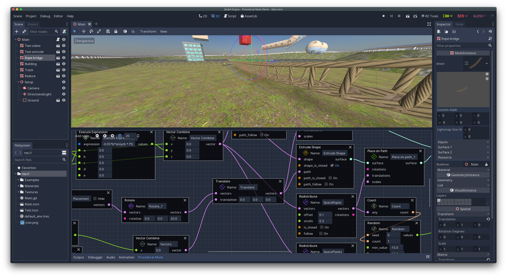

Procedural Mesh Generation module
=================================

A port of [Procedural Mesh Generation GDNative module](https://github.com/BastiaanOlij/gdprocmesh), modified to work as built-in Godot module.

Downloading and compiling
=========================

Clone this repository into Godot's source tree `modules` subfolder as `gdprocmesh_module` and rebuild the engine.

Misc
====
[Orignal GDNative module readme](README_ORIGINAL.md)
